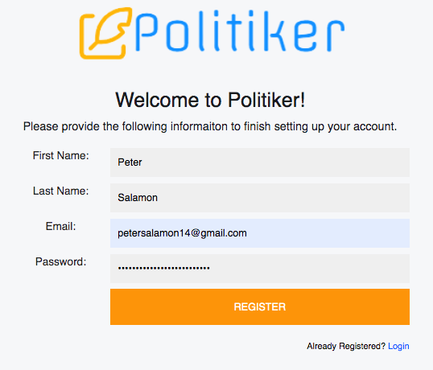

# Politiker
===============	

## Description
A full stack, web-based campaign management and analytics platform.

## Tech Stack
* Backend consists of 
   * Node.js runtime environment coupled with Express web application framework
   * MongoDB (user defined data/lists/campaigns storage)
   * PostgreSQL (production data storage)
   * MySQL (local data storage)
* Frontend consists of 
   * HTML
   * CSS
   * JavaScript
* Miscellaneous
	* Heroku (app deployment)
	* Python
		* Web scraping
		* Data cleaning
		* Geocoding
 
## Overview

Here is a brief overview of the app's features and how to use them. 

### Register/Login

To use the application, simply head over to Politiker.com, sign up for an account, verify your email address, and log in!

### Home

The home page showcases the latest lists and campaigns created by members of your organization as well as a live tracker to help you visualize the number of voters you have contacted, the number of voters you have spoken to, and the breakdown of voters by support type for each campaign your team has created. 

### Maps

The maps page provides an easy to use interactive map to quickly segment voters based on geography and quickly obtain demographic insights about the communities your voters reside in.

### Lists

The lists page is where you naarrow down the voters you want to contact based on geography, age, political affiliation, and more. Curate your lists to the goals of your voter outreach efforts.

### Campaigns

The campaigns page is where you manage your campaigns. Here, you will find a voter list, scripts, and voter information all on a single dashboard, making it easy for volunteers to contact voters and keep track of likely supporters.

### Scripts

On the scripts page, you are able to browse and organize scripts for specific communication types and have them ready for import on any of your campaign dashboards.

### Voter Profiles

If you need more granular detail on your voters, head over to the voter profiles page where you can search for voters using their unique ID number provided by Politiker. 

### Account

As an admin, have complete control over what your team members can do in the account section. Make onboarding to the platform quick and easy for new members and easily contorl user permissions all in one place. Users will find changing their password quick and easy in this section as well.  

### Contact Us

Have questions or need help using the platform? Reach out to our support team for help!

## Credits 
Product of Peter Salamon & Alex Petridis

## License: 
The copying, alteration, and redistribution of this product, expecially for commerical uses, is expressley prohibited without the prior knowledge of the original creators specified in the 'Credits' section above.
